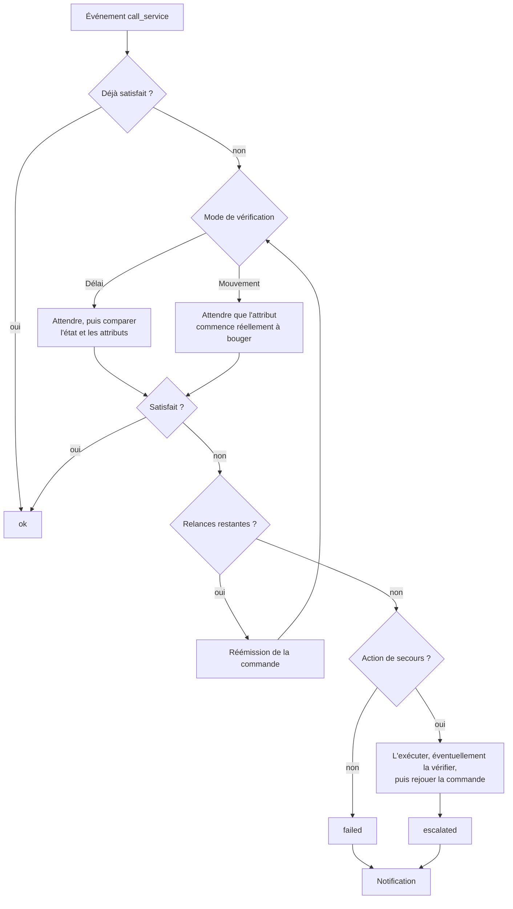

<p align="center">
  
</p>

# Action Control

*[English](https://github.com/cddu33/ha-action_control/blob/main/README.md) | Français*

Contrôle générique, configurable via l'interface Home Assistant, de la bonne
exécution de vos commandes (`light.turn_on`, `switch.turn_off`,
`cover.set_cover_position`, ou n'importe quel autre appel de service).

Elle vérifie qu'une commande a bien été appliquée, la relance en cas
d'échec, notifie, et peut déclencher une action de secours (par exemple
activer un switch) si le problème persiste — le tout sans écrire de YAML,
et sans risque de boucle de réémission grâce à un mécanisme anti-boucle
interne basé sur le `Context` de Home Assistant.



## Fonctionnalités

- **Vérification générique des commandes** — surveille n'importe quel appel
  de domaine/service, pas seulement light/switch/cover.
- **Inclusion personnalisable par règle** — domaine(s), service(s), motif glob
  d'`entity_id`, motif de nom, pièces, étiquettes et/ou appareils.
- **Exclusions** — laissez des entités de côté en les choisissant dans une
  liste, par appareil, ou par motif glob. Utilité principale : un switch
  également exposé en light serait sinon vérifié deux fois par commande.
- **Vérification avec tolérance** — tolérance scalaire (ex. `brightness`
  ±5), tolérance élément par élément pour les attributs de type liste
  (`rgb_color`, `xy_color`), égalité stricte pour le texte et les booléens.
- **Détection de mouvement** — pour les volets par exemple, attend qu'un
  attribut (ex. `current_position`) commence réellement à changer plutôt que
  de comparer un instantané.
- **Sortie immédiate si déjà satisfait** — une commande sans effet, ou déjà
  appliquée quand l'événement se déclenche, se résout instantanément, sans
  délai ni notification.
- **Relances configurables** — nombre et délai par règle, avec un choix
  d'évolution du délai entre relances (constant, linéaire ou exponentiel).
- **Mesure du temps de réponse** — `response_duration` est exposé sur le
  capteur de statut pour chaque vérification.
- **Log optionnel par règle au niveau info** — un résumé d'une ligne par
  entité (résultat, temps de réponse, nombre de tentatives) au niveau
  `info`, pour une visibilité immédiate sans activer le débogage. Désactivé
  par défaut, activable par règle.
- **Escalade configurable** — action de secours optionnelle (activer un
  switch, lancer un script...) déclenchée après échec persistant, avec un
  délai de recharge entre deux escalades et un délai avant de rejouer la
  commande d'origine. Vérifiable : l'action de secours peut être relancée
  jusqu'à ce qu'une entité choisie confirme qu'elle a bien fonctionné,
  avant de rejouer la commande d'origine.
- **Services à la demande** — `run_rule` pour tester une règle avec un
  vrai appel de service sans attendre qu'il se produise, et
  `reset_escalation_cooldown` pour qu'une règle puisse escalader à nouveau
  immédiatement.
- **Notifications** — notification persistante et/ou service `notify.*` de
  votre choix, par règle.
- **Protection anti-boucle intégrée** — chaque commande réémise porte son
  propre `Context` mémorisé, donc l'événement `call_service` correspondant
  est reconnu et ignoré avant de pouvoir redéclencher une règle. Aucune
  entité de garde à configurer.
- **Entièrement configurable par l'interface** — Config Flow (installation)
  + Options Flow (ajout/modification/suppression de règles, paramètres
  globaux). Aucun YAML nécessaire.
- **Capteur de statut par règle** — un capteur de diagnostic (`ok` /
  `retrying` / `escalated` / `failed`) avec le détail de la dernière
  vérification.
- **Diagnostics et réparations** — un export de diagnostics téléchargeable
  pour les rapports de bug, et une réparation signalée quand une règle
  cible une zone/étiquette/appareil qui n'existe plus.
- **Règles suspendables** — une règle peut être désactivée sans être
  supprimée.
- **Interface bilingue** — français et anglais.

## Installation

### Via HACS

1. HACS → Intégrations → menu (⋮) → *Dépôts personnalisés*.
2. Ajouter `https://github.com/cddu33/ha-action_control` en catégorie
   *Intégration*.
3. Installer *Action Control*, puis redémarrer Home Assistant.

### Manuelle

Copier le dossier `custom_components/action_control` dans le répertoire
`custom_components` de votre configuration Home Assistant, puis redémarrer.

## Configuration

Paramètres → Appareils et services → Ajouter une intégration → *Action
Control*. Toute la configuration (règles de surveillance, options
d'escalade, notifications) se fait ensuite depuis le bouton *Configurer*
de l'intégration — aucun YAML n'est nécessaire.

L'assistant demande d'abord les fonctionnalités voulues, puis n'affiche que
les réglages que ces choix nécessitent réellement :

- **Inclusion** : domaine(s), service(s), motif d'`entity_id`, motif de nom,
  pièces, étiquettes, appareils.
- **Exclusion** (seulement si cochée) : des entités choisies dans une liste,
  des appareils, ou des motifs glob.
- **Comportement** : comment vérifier (Délai ou Mouvement), faut-il une
  action de secours, journalisation et notifications.
- **Vérification** : attributs à vérifier avec tolérance (ex. `brightness`,
  `rgb_color`), nombre de relances et évolution du délai — plus le délai
  avant contrôle, ou l'attribut à surveiller, selon le mode. Les domaines
  `light`, `switch` et `cover` sont préremplis avec des valeurs par défaut
  adaptées.
- **Secours** (seulement si cochée) : quoi exécuter si la vérification
  échoue de manière persistante, avec un délai minimum entre
  deux escalades — et éventuellement une entité à contrôler pour confirmer
  qu'elle a fonctionné.

L'assistant se termine sur un **menu de la règle** — un bouton par section,
plus *Enregistrer la règle*. C'est là qu'on corrige une erreur faite plus
tôt, et c'est là que commence la modification d'une règle existante :
changer un seul champ n'oblige plus à retraverser tous les formulaires.

Voir la [documentation complète](https://github.com/cddu33/ha-action_control/blob/main/docs/documentation.fr.md) pour la
référence détaillée de chaque champ, des exemples prêts à l'emploi, la
journalisation de débogage et les limites connues.

## Exemple d'usage

- Une règle sur le domaine `light` vérifie que la luminosité et la couleur
  demandées ont bien été appliquées, avec tolérance, et relance la commande
  jusqu'à 2 fois en cas d'échec.
- Une règle sur le domaine `cover`, avec un motif `cover.volet_*`, attend
  qu'un volet commence réellement à bouger ; si ce n'est pas le cas, elle
  active un switch de redémarrage de passerelle puis rejoue la commande.

## Dépannage

Activer les journaux de débogage :

```yaml
logger:
  logs:
    custom_components.action_control: debug
```

Voir la [documentation](https://github.com/cddu33/ha-action_control/blob/main/docs/documentation.fr.md) pour plus de détails,
notamment la marche à suivre quand une règle ne se déclenche pas.
