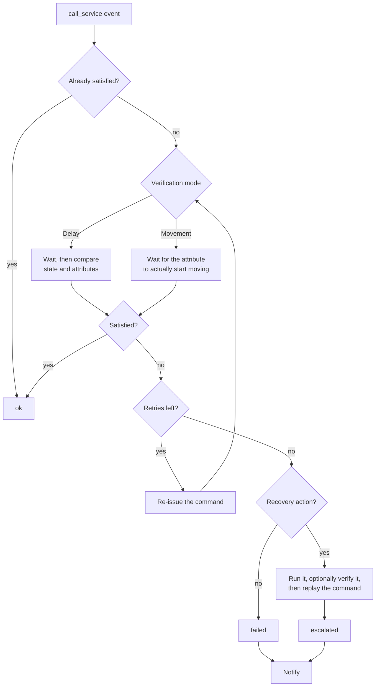

<p align="center">
  
</p>

# Action Control

*English | [Français](https://github.com/cddu33/ha-action_control/blob/main/README.fr.md)*

A generic, fully UI-configurable watchdog for Home Assistant: verify that
your commands (`light.turn_on`, `switch.turn_off`,
`cover.set_cover_position`, or any other service call) actually took
effect.

It checks that a command was actually applied, retries it on failure,
notifies you, and can trigger a recovery action (e.g. turning on a switch)
if the problem persists — all without writing any YAML, and without risk of
a retry loop thanks to a built-in anti-loop mechanism based on Home
Assistant's `Context`.



## Features

- **Generic command verification** — watches any domain/service call, not
  just light/switch/cover.
- **Customizable inclusion per rule** — domain(s), service(s), `entity_id`
  glob pattern, friendly-name pattern, areas, labels, and/or devices.
- **Exclusions** — leave entities out of a rule by picking them from a
  list, by device, or by glob pattern. What it is mostly for: a switch also
  exposed as a light would otherwise be verified twice per command.
- **Tolerance-based verification** — scalar tolerance (e.g. `brightness`
  ±5), element-wise tolerance for list attributes (`rgb_color`,
  `xy_color`), exact match for text/boolean attributes.
- **Movement/change detection** — for entities like covers, waits for an
  attribute (e.g. `current_position`) to actually start changing instead
  of doing a snapshot comparison.
- **Immediate exit when already satisfied** — a no-op command, or one
  already applied by the time the event fires, resolves instantly with no
  delay or notification.
- **Configurable retries** — retry count and delay per rule, with a choice
  of delay growth between retries (constant, linear, or exponential).
- **Response time tracking** — each check's `response_duration` is exposed
  on the status sensor.
- **Optional per-rule info-level log** — a one-line summary per entity
  (outcome, response time, attempt count) at `info` level, so you get
  at-a-glance visibility without enabling debug logging. Off by default,
  toggle it per rule.
- **Configurable escalation** — an optional recovery action (turn on a
  switch, run a script, ...) triggered after persistent failure, with a
  cooldown between escalations and a delay before replaying the original
  command. Optionally verified: the recovery action can be re-run until a
  chosen entity confirms it actually worked, before the original command
  is replayed.
- **On-demand services** — `run_rule` to test a rule against a real service
  call without waiting for one to happen, and `reset_escalation_cooldown`
  to let a rule escalate again right away.
- **Notifications** — persistent notification and/or a `notify.*` service
  of your choice, per rule.
- **Built-in anti-loop protection** — every command the integration
  re-issues carries its own tracked `Context`, so the resulting
  `call_service` event is recognized and ignored before it can re-trigger
  any rule. No guard entity to configure.
- **Fully configured through the UI** — Config Flow (setup) + Options Flow
  (add/edit/delete rules, global settings). No YAML required.
- **Per-rule status sensor** — a diagnostic sensor (`ok` / `retrying` /
  `escalated` / `failed`) with the details of the last check.
- **Diagnostics and repairs** — a downloadable diagnostics dump for bug
  reports, and a repair issue when a rule targets an area/label/device
  that no longer exists.
- **Rules can be paused** — a rule can be disabled without deleting it.
- **Bilingual UI** — English and French.

## Installation

### Via HACS

1. HACS → Integrations → menu (⋮) → *Custom repositories*.
2. Add `https://github.com/cddu33/ha-action_control` as category
   *Integration*.
3. Install *Action Control*, then restart Home Assistant.

### Manual

Copy the `custom_components/action_control` folder into the
`custom_components` directory of your Home Assistant configuration, then
restart.

## Configuration

Settings → Devices & services → Add integration → *Action Control*. All
configuration (watchdog rules, escalation options, notifications) is then
done from the integration's *Configure* button — no YAML needed.

The wizard asks for the capabilities you want first, then only shows the
settings those choices actually need:

- **Inclusion**: domain(s), service(s), `entity_id` pattern, name pattern,
  areas, labels, devices.
- **Exclusion** (only if ticked): entities picked from a list, devices, or
  glob patterns.
- **Behavior**: how to verify (delay or movement), whether to run a
  recovery action, logging and notifications.
- **Verification**: attributes to check with tolerance (e.g. `brightness`,
  `rgb_color`), retry count and delay growth — plus the delay before the
  first check, or the attribute to watch, depending on the mode. The
  `light`, `switch`, and `cover` domains come with sensible defaults
  pre-filled.
- **Recovery** (only if ticked): what to run when verification keeps
  failing, with a minimum delay between two escalations — and optionally an
  entity to check to confirm it worked.

The wizard ends on a **rule menu** — one button per section, plus *Save the
rule*. That is where you correct a mistake made earlier, and where editing
an existing rule starts, so changing one field does not mean walking every
form again.

See the [full documentation](https://github.com/cddu33/ha-action_control/blob/main/docs/documentation.md) for a field-by-field
reference, ready-to-use recipes, debug logging, and known limitations.

## Usage example

- A rule on the `light` domain checks that the requested brightness and
  color were actually applied, with tolerance, and retries the command up
  to 2 times on failure.
- A rule on the `cover` domain, with an `cover.volet_*` pattern, waits for
  a cover to actually start moving; if it doesn't, it turns on a gateway
  restart switch and then replays the command.

## Troubleshooting

Enable debug logging:

```yaml
logger:
  logs:
    custom_components.action_control: debug
```

See the [documentation](https://github.com/cddu33/ha-action_control/blob/main/docs/documentation.md) for more, including what to
check when a rule never triggers.
