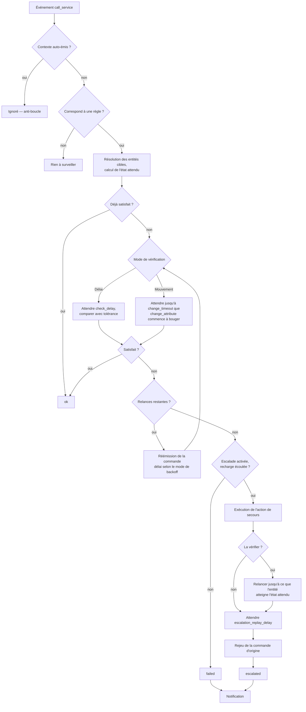
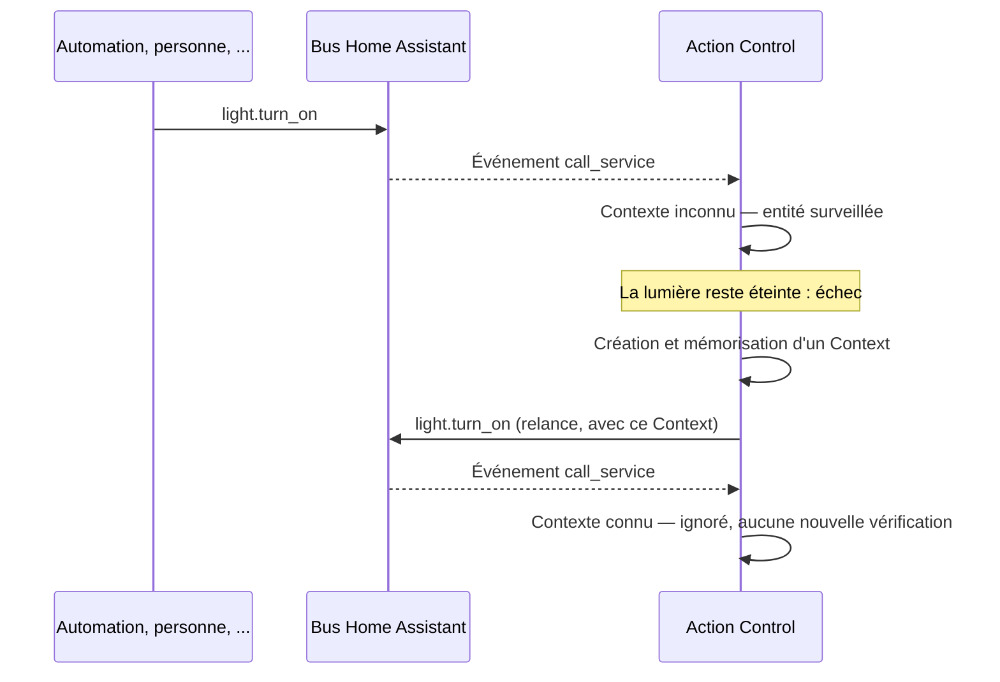
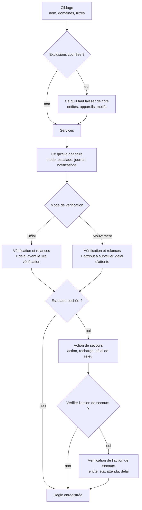

# Action Control — Documentation

*[English](documentation.md) | [Français](documentation.fr.md)*

## Sommaire

- [Fonctionnement](#fonctionnement)
- [Configurer les règles](#configurer-les-règles)
- [Référence des champs de règle](#référence-des-champs-de-règle)
- [Ce qui est comparé](#ce-qui-est-comparé)
- [Capteur de statut](#capteur-de-statut)
- [Exemples](#exemples)
- [Journalisation de débogage](#journalisation-de-débogage)
- [Limites connues](#limites-connues)

## Fonctionnement

Action Control écoute l'événement interne `call_service` de Home
Assistant — l'événement émis pour *chaque* appel de service, quelle que
soit son origine (une personne, une automation, un script, un assistant
vocal, une autre intégration). Pour chaque règle configurée, sur un appel
correspondant :

1. **Résout les entités ciblées** — à partir d'`entity_id`, `device_id`,
   `area_id`, `label_id` et/ou `floor_id` de l'appel, via les registres
   entité, appareil et pièce, puis ne garde que les entités qui passent
   aussi les filtres de la règle (domaine, motifs, pièces, étiquettes,
   appareils). Les entités désactivées, et celles sans état, sont écartées :
   elles ne pourraient que faire échouer la vérification.
2. **Calcule ce qui est attendu** — l'état impliqué par le service, et les
   attributs réellement transmis dans l'appel. Ce calcul est fait de façon
   synchrone, dans le callback de l'événement : un `toggle` est donc jugé
   par rapport à l'état tel qu'il était à l'instant de la commande. Voir
   [Ce qui est comparé](#ce-qui-est-comparé).
3. **Vérifie une correspondance immédiate.** Si l'entité reflète déjà
   l'état/les attributs demandés au moment même où l'événement se
   déclenche (commande sans effet, ou déjà appliquée instantanément par
   l'intégration cible), la règle se résout immédiatement — sans délai,
   sans notification.
4. Sinon, selon le mode :
   - **Mode Délais** (par défaut) : attend `check_delay` secondes, puis
     compare l'état/les attributs de l'entité à ce qui a été demandé, avec
     tolérance. En cas d'écart, la règle relance la commande et retente
     jusqu'à `retries` fois, espacées de `retry_delay` secondes. Au pire :
     `check_delay + retries × retry_delay`.
   - **Mode Mouvement** (`wait_for_change`, activé par défaut pour les
     volets) : au lieu de comparer un instantané après un délai fixe,
     attend jusqu'à `change_timeout` secondes que `change_attribute`
     commence réellement à changer. Si ce n'est pas le cas, c'est
     l'échec — la commande est réémise et l'attente repart, jusqu'à
     `retries` fois. `retry_delay` n'est pas utilisé dans ce mode ; au
     pire : `(retries + 1) × change_timeout`.
5. **En cas d'échec persistant**, si l'escalade est activée et que son
   délai de recharge est écoulé : exécute l'action de secours configurée,
   arme le délai de recharge, attend `escalation_replay_delay` secondes,
   puis rejoue une dernière fois la commande d'origine.
6. **Notifie** (notification persistante et/ou service `notify.*`) en
   précisant ce qui était attendu par rapport à ce qui a été observé.



Chaque relance réémet la commande pour cette seule entité : les clés de
ciblage d'origine (`entity_id`, `device_id`, `area_id`, `label_id`,
`floor_id`) sont remplacées par l'`entity_id` concerné, le reste des
données de service étant conservé tel quel.

Une seule exécution à la fois par couple (règle, entité) : si la même
entité reçoit une nouvelle commande alors qu'une vérification est encore en
cours, la seconde attend la fin de la première au lieu d'entrer en
concurrence avec elle, et l'ancienne est ensuite abandonnée plutôt que de
réémettre une commande qui ne correspond plus à ce qui a été demandé.
Plusieurs règles qui correspondent au même appel s'exécutent
indépendamment.

### Protection anti-boucle

Chaque commande réémise par Action Control (relance, action d'escalade
elle-même, ou rejeu après escalade) porte un `Context` Home Assistant
propre, créé pour l'occasion et mémorisé en interne pendant 120 secondes.
Le déclencheur reconnaît et ignore tout événement `call_service` portant
un de ces contextes auto-émis *avant* tout traitement — c'est ce qui
empêche une relance de se re-déclencher elle-même ou une autre règle, sans
entité de garde ni configuration supplémentaire.

Cette mémoire est volontairement limitée au processus en cours (un
redémarrage de Home Assistant la vide) — il n'y a jamais rien de
significatif à conserver d'un redémarrage à l'autre, puisqu'un redémarrage
arrête de toute façon toute vérification en cours.



## Configurer les règles

Toute la configuration se fait depuis le bouton **Configurer** de
l'intégration (Paramètres → Appareils et services → Action Control). Le
menu propose :

| Entrée de menu | Rôle |
|---|---|
| Ajouter une règle | Assistant : ce qu'il faut surveiller → quels services → ce que la règle doit faire → les réglages correspondants. |
| Modifier une règle | Le même assistant, prérempli avec la règle choisie. |
| Supprimer une règle | Demande confirmation, puis supprime la règle et son capteur. |
| Paramètres globaux | Interrupteur général et valeurs par défaut, voir [Paramètres globaux](#paramètres-globaux). |

L'assistant ne demande que ce que la règle utilise réellement : vous cochez
les fonctionnalités voulues à l'étape *ce qu'elle doit faire*, et les
étapes suivantes n'affichent que les réglages correspondants. Une règle qui
se contente de relancer une commande tient en quatre étapes courtes ;
l'escalade et sa vérification n'ajoutent des étapes que si vous les
demandez.

Chaque étape de l'assistant se termine par une case **Revenir à l'étape
précédente** : cochez-la, validez, et vous revenez à l'étape d'avant — avec
tout ce que vous aviez saisi, sur les deux étapes. Depuis la première
étape, le retour ramène au menu et abandonne la règle.



Une seule instance de l'intégration est nécessaire — une seconde tentative
d'ajout est volontairement refusée. Enregistrer une modification recharge
l'intégration pour que les capteurs suivent la liste des règles ; ce
rechargement annule aussi les vérifications en cours et remet les capteurs
de statut sur `idle`.

## Référence des champs de règle

### Ciblage

| Champ | Description |
|---|---|
| Nom | Libellé affiché sur le capteur de statut de la règle et dans les notifications. |
| Règle activée | Désactivée, la règle est mise en pause sans être supprimée — son capteur reste, mais plus rien n'est surveillé. Les règles en pause sont préfixées par ⏸ dans les listes de sélection. |
| Domaines | Un ou plusieurs domaines surveillés par cette règle (ex. `light`, `switch`, `cover`). Obligatoire. La liste propose les domaines réellement présents dans votre instance, traduits, et accepte aussi un domaine saisi à la main. |
| Services | Services surveillés dans ces domaines (ex. `turn_on`). Les suggestions correspondent à tous les services des domaines choisis. Laisser vide pour surveiller tous les services de ces domaines. |
| Motif d'entity_id | Motif glob optionnel (ex. `cover.volet_*`) que l'`entity_id` doit respecter. Sensible à la casse. |
| Motif de nom convivial | Motif glob optionnel comparé au nom de l'entité, sans tenir compte de la casse. |
| Pièces / Étiquettes / Appareils | Filtres optionnels — une entité correspond si elle (ou son appareil) appartient à une des pièces/étiquettes/appareils sélectionnés. |
| Laisser de côté certaines entités ou certains appareils | Décoché, l'étape d'exclusion est sautée ; le décocher sur une règle existante efface aussi ce qu'elle excluait. |

Les filtres se cumulent (ET logique) : une entité doit satisfaire tous
ceux qui sont renseignés. Une règle sans aucun filtre
motif/pièce/étiquette/appareil correspond à toutes les entités du/des
domaine(s)/service(s) choisis — par exemple « surveiller toutes les
lumières ».

### Ce qu'il faut laisser de côté

Affichée seulement si *Laisser de côté certaines entités ou certains
appareils* est coché à l'étape de ciblage. Les exclusions l'emportent sur
tous les filtres d'inclusion ci-dessus : c'est ce qui permet à une règle de
couvrir un domaine entier moins quelques entités.

| Champ | Description |
|---|---|
| Entités à laisser de côté | À choisir dans une liste, limitée aux domaines de la règle. C'est le moyen direct et lisible d'écarter une entité précise. |
| Appareils à laisser de côté | Retire **toutes** les entités de cet appareil. Pour un « ne jamais rien surveiller sur cet appareil » — une passerelle que vous savez capricieuse, par exemple. |
| Entity_id à exclure | Motifs glob (ex. `light.salon_multiprise_*`), pour les cas plus larges. Ajoutez-en autant que nécessaire — les entités qui se doublonnent partagent rarement un préfixe unique. |

Le cas qui a fait naître cette étape : un switch également exposé en light
(*changer le type d'appareil* de Home Assistant), vérifié et relancé deux
fois pour une seule commande. **Excluez l'entité en double, pas son
appareil** : `switch_as_x` rattache le `light.x` dérivé au même appareil
que `switch.x`, donc exclure l'appareil retirerait les deux et la règle ne
surveillerait plus rien.

### Ce qu'elle doit faire

L'étape qui décide des étapes suivantes à remplir.

| Champ | Description | Par défaut |
|---|---|---|
| Comment vérifier la commande | **Délai** — attendre, puis comparer l'état et les attributs. **Mouvement** — attendre qu'un attribut commence réellement à changer, pour ce qui se déplace (volets). Ce choix détermine les champs demandés à l'étape de vérification. | Délai (Mouvement pour `cover`) |
| Déclencher une action de secours en cas d'échec persistant | Décoché, les étapes d'action de secours sont entièrement sautées. | désactivé |
| Journaliser un résumé pour cette règle au niveau info | Si activé, le résultat final de chaque entité (ok/escalated/failed) pour cette règle est aussi journalisé au niveau `info` — entité, résultat, temps de réponse, nombre de tentatives — visible sans activer le debug. Désactivé par défaut ; la trace détaillée pas à pas reste réservée au journal debug. | désactivé |
| Notifier via une notification persistante | Crée une `persistent_notification` intitulée `Action Control: <nom de la règle>` en cas d'échec final. | activé |
| Notifier également via ce service notify | Appelle aussi ce service `notify.*` en cas d'échec final, avec le même titre et le même message. | — |

### Vérification

| Champ | Description | Par défaut (plage) |
|---|---|---|
| Délai avant la première vérification | Secondes d'attente après la commande avant la première comparaison. **Mode Délai uniquement.** | 2 (0–120) |
| Attributs à vérifier | Attributs comparés en plus de l'état (ex. `brightness`, `rgb_color`). Seuls ceux réellement présents dans l'appel de service sont comparés. | aucun |
| Tolérances | `attribut:valeur, attribut2:valeur2` — tolérance numérique par attribut. Les attributs de type liste (comme `rgb_color`) appliquent la tolérance élément par élément. Les entrées illisibles sont ignorées. | aucune (égalité stricte) |
| Nombre de relances | Combien de fois relancer la commande si la vérification échoue. | 2 (0–10) |
| Délai entre les relances | Secondes entre chaque relance (mode Délai uniquement). | 2 (0–600) |
| Évolution du délai entre les relances | Comment le délai entre relances évolue : `constant` (même délai à chaque fois), `linear` (délai × numéro de tentative), ou `exponential` (le délai double à chaque fois, plafonné à 3600 s). Ne concerne que le mode Délai — le mode Mouvement n'a de toute façon pas de délai entre les tentatives. | constant |
| Attribut à surveiller | L'attribut surveillé par le mode Mouvement (ex. `current_position`). **Mode Mouvement uniquement**, et obligatoire — l'étape ne se valide pas sans lui. | — |
| Délai d'attente du changement | Secondes à attendre avant de considérer que le changement a échoué. **Mode Mouvement uniquement.** | 45 (1–600) |

Quand une règle vise exactement un des domaines `light`, `switch` ou
`cover`, des valeurs par défaut adaptées sont préremplies
automatiquement :

| Domaine | Valeurs préremplies |
|---|---|
| `light` | Attributs `brightness`, `rgb_color`, `color_temp_kelvin`, `xy_color`, avec les tolérances `5`, `5`, `100`, `0.01`. |
| `switch` | État seul, aucun attribut. |
| `cover` | Mode Mouvement sur `current_position`, délai de 45 s. |

Tout autre domaine — ou une règle visant plusieurs domaines à la fois —
part d'une simple vérification d'état, à affiner avec les champs
ci-dessus.

### Action de secours

Demandée uniquement si *Déclencher une action de secours* est coché.

| Champ | Description | Par défaut (plage) |
|---|---|---|
| Action d'escalade | N'importe quelle séquence d'actions Home Assistant (appel de service, script...) — le même éditeur d'action que dans les automations. Une action en erreur est journalisée sans interrompre la vérification. | — |
| Délai minimum entre deux escalades | Délai de recharge, en secondes, avant qu'une même règle puisse escalader à nouveau. Compté à partir de la fin de l'action, et commun à toutes les entités de la règle. | 300 (0–86400) |
| Délai après l'escalade avant de rejouer la commande | Secondes d'attente après l'action d'escalade avant de rejouer la commande d'origine. | 90 (0–3600) |
| Vérifier que l'action de secours a fonctionné | Ajoute une étape pour contrôler que l'action de secours a bien pris effet, au lieu de le supposer. | désactivé |

Le délai de recharge est armé *avant* l'exécution de l'action de secours,
et il survit à un redémarrage : des entités qui échouent au même moment ne
peuvent donc pas déclencher l'action plusieurs fois. Une escalade activée
sans action configurée ne fait rien et est journalisée en avertissement.

### Vérification de l'action de secours

Demandée uniquement si *Vérifier que l'action de secours a fonctionné* est
coché.

| Champ | Description | Par défaut (plage) |
|---|---|---|
| Entité à vérifier après l'action de secours | L'entité dont l'état prouve que l'action de secours a fonctionné. Obligatoire. | — |
| État qu'elle doit atteindre | L'état que cette entité doit atteindre (ex. `on`). Obligatoire. | — |
| Délai avant de la vérifier | Secondes d'attente avant la première vérification. | 5 (0–600) |

L'action de secours est relancée (jusqu'au nombre de relances configuré,
avec la même évolution de délai que les relances normales) jusqu'à ce que
cette entité atteigne l'état attendu, avant de rejouer la commande
d'origine. Utile pour les actions de secours qui peuvent elles-mêmes
échouer — un switch de redémarrage de passerelle qui ne fonctionne pas
toujours du premier coup, par exemple. Si l'état attendu n'est toujours pas
atteint après toutes les relances, la commande d'origine est quand même
rejouée (un avertissement est journalisé), exactement comme si aucune
vérification n'avait été configurée.

La notification d'échec part juste après le rejeu, sans nouvelle attente :
elle décrit donc l'état observé à ce moment-là et signale qu'une action de
secours a été déclenchée. Elle porte un identifiant stable par (règle,
entité) : un échec répété remplace sa notification au lieu d'en empiler une
nouvelle. Le rejeu lui-même n'est pas re-vérifié — s'il fonctionne, la mise
à jour suivante du statut viendra de la prochaine commande sur cette
entité.

### Paramètres globaux

| Champ | Description | Par défaut (plage) |
|---|---|---|
| Action Control activé | Interrupteur général. Désactivé, les événements `call_service` sont ignorés : aucune vérification, aucune relance, aucune notification. Les règles conservent leur configuration. | activé |
| Nombre de relances par défaut pour les nouvelles règles | Prérempli le champ correspondant d'une **nouvelle** règle. Les règles existantes gardent leur propre valeur. | 2 (0–10) |
| Délai par défaut entre les relances pour les nouvelles règles | Idem, pour le délai entre les relances. | 2 (0–600) |

## Ce qui est comparé

**État attendu.** Il est déduit du service appelé :

| Service | État(s) attendu(s) |
|---|---|
| `turn_on` / `turn_off`, domaines on/off uniquement | `on` / `off` |
| `toggle`, domaines on/off uniquement | l'inverse de l'état au moment de l'appel |
| `cover.open_cover`, `valve.open_valve` | `open` ou `opening` |
| `cover.close_cover`, `valve.close_valve` | `closed` ou `closing` |
| `cover.toggle`, `valve.toggle` | `closed`/`closing` s'il était ouvert, `open`/`opening` sinon |
| `lock.lock` / `lock.unlock` / `lock.open` | `locked`/`locking`, `unlocked`/`unlocking`, `open`/`opening`/`unlocked` |
| tout autre service | aucun — seuls les attributs sont comparés |

Les domaines on/off sont `light`, `switch`, `fan`, `siren`, `input_boolean`,
`humidifier`, `remote` et `automation`. Tout le reste — `climate`,
`media_player`, `water_heater`... — n'a aucun état attendu pour
`turn_on`/`toggle`, parce que « on » n'est pas ce que ces entités
rapportent. Les états transitoires (`opening`, `closing`, `locking`...) sont
acceptés : c'est le mode Mouvement qui surveille le déplacement lui-même.

**Attributs attendus.** Un attribut listé dans *Attributs à vérifier*
n'est comparé que s'il était réellement présent dans l'appel de service :
un `light.turn_on` sans `brightness` ne vérifie donc pas la luminosité,
même si `brightness` figure dans la liste. Deux alias gèrent les clés de
données de service dont le nom diffère de celui de l'attribut d'état :

- `cover.set_cover_position`, `valve.set_valve_position` : `position` →
  `current_position`
- `cover.set_cover_tilt_position` : `tilt_position` → `current_tilt_position`
- `light.turn_on` : `brightness_pct` → `brightness` (converti en 0–255) et
  `kelvin` → `color_temp_kelvin` ; un `brightness` explicite dans l'appel
  reste prioritaire

**Règles de comparaison.**

- Nombres : correspondance si `|attendu − réel| ≤ tolérance` (tolérance
  `0` si rien n'est configuré).
- Listes/tuples (`rgb_color`, `xy_color`...) : comparés élément par
  élément avec la même tolérance ; deux longueurs différentes ne
  correspondent jamais.
- Texte, booléens, tout le reste : égalité stricte.
- Un attribut attendu à `None` est toujours considéré comme satisfait ;
  une entité sans état du tout est toujours en écart.

**Domaines sans rien de significatif à comparer** (les scènes, et tout
couple domaine/service non listé ci-dessus sans attribut configuré non
plus) obtiennent un état attendu `None` et aucun attribut attendu. La
vérification immédiate d'une telle règle est alors trivialement satisfaite
— elle se résout instantanément, sans délai ni relance, dès la première
exécution. C'est voulu : l'état d'une scène est un horodatage de dernière
activation, pas une cible à atteindre, donc il n'y a rien à vérifier
au-delà du fait que l'appel a été accepté. Un preset `scene` (vide, comme
`switch`) existe surtout pour rendre ce comportement explicite plutôt que
de le laisser en simple effet de bord implicite.

## Capteur de statut

Chaque règle dispose d'un capteur de diagnostic portant son nom, regroupé
sous un appareil de service unique *Action Control*. Son état est le
dernier résultat connu :

| État | Signification |
|---|---|
| `idle` | Aucune vérification n'a encore eu lieu (également l'état juste après un rechargement). |
| `ok` | Dernière vérification réussie — immédiatement, ou après relance. |
| `retrying` | Une vérification est en cours et la commande est en train d'être relancée. |
| `escalated` | La vérification a échoué et l'action d'escalade a été exécutée. |
| `failed` | La vérification a échoué (pas d'escalade, ou délai de recharge non écoulé). |

Les libellés d'état sont traduits (français/anglais), tout comme les
textes de notification. Attributs : `entity_id`, `expected_state`,
`expected_attributes`, `actual_state`, `actual_attributes`, `attempt`,
`mismatches`, `last_checked` (UTC, ISO 8601), `response_duration`
(secondes écoulées depuis l'émission de la commande, mesurées de
l'événement `call_service` jusqu'au statut courant — continue d'augmenter
tant que l'état est `retrying`, se fige une fois la règle résolue).

Le capteur reflète la **dernière** exécution de la règle. Quand une
commande vise plusieurs entités, toutes sont surveillées, mais le capteur
ne conserve que la dernière mise à jour — le journal de débogage donne le
détail entité par entité.

## Services

| Service | Utilité |
|---|---|
| `action_control.run_rule` | Teste une règle à la demande : rejoue un appel de service sur une entité choisie et laisse la règle le vérifier, exactement comme si cet appel avait eu lieu normalement. Champs : la règle (via son capteur de statut), l'entité à tester, et des données de service optionnelles — y inclure une clé `service` pour utiliser autre chose que le premier service configuré de la règle. |
| `action_control.reset_escalation_cooldown` | Efface le délai de recharge d'une règle pour qu'elle puisse escalader à nouveau immédiatement, sans attendre le délai configuré. |

Les deux utilisent le capteur de statut de la règle pour la sélectionner,
donc aucun identifiant de règle n'est à saisir à la main.

## Diagnostics et réparations

L'entrée de l'intégration prend en charge le téléchargement de diagnostics
intégré à Home Assistant (règles, paramètres globaux et statuts courants,
avec tout ce qui ressemble à un token/mot de passe/clé API/webhook id
masqué) — utile pour joindre à un rapport de bug.

Si une règle cible une zone, une étiquette ou un appareil qui a depuis été
supprimé, une réparation est signalée au rechargement, nommant la règle
concernée ; elle disparaît d'elle-même une fois la règle corrigée ou la
cible manquante retirée.

## Exemples

### Surveillance de lumières

- Domaines : `light`
- Services : `turn_on`, `turn_off`, `toggle` (ou vide pour tous)
- Attributs à vérifier : `brightness`, `rgb_color` (préremplis par défaut)
- Relances : 2, délai 2 s

Vérifie que la luminosité/couleur demandées ont bien été appliquées, avec
tolérance, et relance en cas d'écart.

### Surveillance de volets / redémarrage de passerelle

- Domaines : `cover`
- Motif d'entity_id : `cover.volet_*`
- Comment vérifier la commande : **Mouvement**, attribut
  `current_position`, délai 45 s
- Déclencher une action de secours : **activé** — action = `switch.turn_on`
  sur le switch de redémarrage de votre passerelle, délai de recharge
  300 s, délai de rejeu 90 s
- Vérifier que l'action de secours a fonctionné : **activé** — entité =
  `switch.gateway_restart`, état `on`, délai 5 s

Attend qu'un volet commence réellement à bouger ; si ce n'est pas le cas
après les relances, active le switch de redémarrage de la passerelle,
confirme que le switch est bien repassé sur `on` (en relançant le
redémarrage sinon), attend, puis rejoue la commande d'origine.

### Position de volet exacte

- Domaines : `cover`
- Services : `set_cover_position`
- Comment vérifier la commande : **Délai**
- Attributs à vérifier : `current_position`
- Tolérances : `current_position:2`
- Délai avant la première vérification : 30 s (le temps que le volet
  finisse sa course)

Vérifie qu'un volet a bien atteint la position demandée, à ±2 %. La clé
`position` de l'appel de service est automatiquement rapprochée de
l'attribut `current_position`.

### Consigne de thermostat

- Domaines : `climate`
- Services : `set_temperature`
- Attributs à vérifier : `temperature`
- Tolérances : `temperature:0.2`
- Délai avant la première vérification : 5 s

Détecte les consignes silencieusement perdues par une liaison radio
capricieuse.

### Activation de scène

- Domaines : `scene`
- Services : `turn_on` (ou vide)

Il n'y a rien à vérifier (l'état d'une scène est un horodatage, pas une
cible), donc la règle se résout immédiatement, sans délai ni relance. La
configurer reste utile surtout pour la métrique de temps de réponse
qu'elle enregistre quand même (`response_duration` sur le capteur, et le
log niveau info si activé), qui sert aussi de confirmation que l'appel
`scene.turn_on` est bien passé.

## Journalisation de débogage

Rien ne nécessite de redémarrage pour essayer : Outils de développement
→ Actions → appeler le service `logger.set_level` avec :

```yaml
custom_components.action_control: debug
```

Pour un réglage permanent, ajoutez dans `configuration.yaml` puis
redémarrez complètement Home Assistant :

```yaml
logger:
  logs:
    custom_components.action_control: debug
```

Au niveau debug, vous verrez quelles règles un appel de service a
déclenchées, quelles entités sont surveillées et avec quel état/attributs
attendus, chaque tentative de vérification/relance avec ses écarts,
l'escalade et le rejeu, les appels auto-émis ignorés, ainsi que les
notifications envoyées.

### Ce que vous avez sans activer le debug

Toujours journalisé, sans aucune configuration :

| Niveau | Quand |
|---|---|
| `warning` | La vérification d'une règle a définitivement échoué (avec les écarts). |
| `warning` | L'entité de vérification d'escalade n'a jamais atteint l'état attendu. |
| `warning` | L'escalade est activée sur une règle mais aucune action n'est configurée. |
| `error` | Une commande, une action de secours ou une notification a levé une erreur — journalisée avec sa trace, sans interrompre la vérification. |

### Le résumé par règle (`info`)

Cocher *Journaliser un résumé… au niveau info* à l'étape **ce qu'elle doit
faire** d'une règle ajoute une ligne `info` par entité, à chaque résolution
de cette règle :

```
Rule 'Lights watchdog': light.kitchen -> ok in 0.42s (0 attempt(s))
```

Une ligne par entité et par résultat (`ok`, `escalated`, `failed`) — pas une
par relance. C'est le moyen de suivre les temps de réponse sans activer le
debug sur tout le composant.

> **Ces lignes n'apparaissent pas dans Réglages → Système → Journaux.** Ce
> panneau n'affiche que `warning` et au-dessus. Cliquez sur **Charger les
> journaux complets**, ou ouvrez directement `config/home-assistant.log`, et
> cherchez `Rule '`. C'est le piège classique : la fonctionnalité semble
> cassée alors qu'elle est seulement masquée.

Si vous préférez ne pas lire les journaux, le même temps de réponse est
disponible dans l'attribut `response_duration` du capteur de statut de la
règle.

À noter : une vérification **remplacée** — une commande plus récente arrive
sur la même entité alors qu'un contrôle est encore en cours — s'arrête sans
ligne finale. C'est la nouvelle vérification qui journalisera son résultat.

### Quand une règle ne se déclenche jamais

1. Vérifiez l'interrupteur général dans *Paramètres globaux*.
2. Repérez la ligne de debug `call_service ...` et comparez son domaine à
   ceux de votre règle : une règle ne réagit qu'aux appels dont le
   **domaine** figure dans sa liste, et certains raccourcis appellent les
   services sous leur propre domaine (`homeassistant.turn_on` est un appel
   du domaine `homeassistant`).
3. `... resolved to no entities` signifie que l'appel ne portait aucune
   cible exploitable ; `has no state, nothing to watch` signifie que
   l'entité n'existe pas dans Home Assistant (une entité désactivée n'est
   jamais surveillée non plus).
4. L'absence de ligne `watching ...` pour votre entité signifie qu'un des
   filtres de la règle (motif, pièce, étiquette, appareil) l'a écartée.
5. `Ignoring self-issued call_service event` signifie que l'appel venait
   d'Action Control lui-même — c'est la protection anti-boucle qui fait
   son travail.

### Quand une règle signale un échec qui n'en est pas un

Si l'écart montre l'état *inverse* de celui demandé — attendu `on`, actuel
`off`, avec les attributs à `None` — l'entité a presque certainement reçu
une nouvelle commande avant la fin de la vérification, plutôt que d'avoir
échoué à appliquer la première.

Une commande plus récente annule normalement la vérification en cours, mais
seulement si elle parvient à Action Control sous forme d'événement
`call_service` correspondant à la même règle. Ce n'est pas le cas quand :

- quelqu'un a appuyé sur un **interrupteur physique**, ou qu'une
  télécommande est **liée directement** à l'appareil (les groupes et
  liaisons Zigbee ne remontent jamais à Home Assistant comme appel de
  service) ;
- la commande est passée par **`homeassistant.turn_on`/`turn_off`**, ou par
  une scène ou un script qui les utilise — ce sont des appels du domaine
  `homeassistant`, donc une règle surveillant `light` ou `switch` ne leur
  correspond pas.

Pour ce second cas, ajoutez `homeassistant` aux domaines de la règle, ou
augmentez `check_delay` pour laisser la situation se stabiliser avant la
comparaison.

## Limites connues

- **Les textes de notification n'existent qu'en français et en anglais**,
  choisis selon la langue de Home Assistant, anglais par défaut.
- **Un seul capteur de statut par règle** : une commande visant plusieurs
  entités à la fois ne laisse que le dernier résultat sur le capteur.
- **Modifier une règle recharge l'intégration**, ce qui annule les
  vérifications en cours et remet les capteurs sur `idle`.
- **Une vérification occupe son créneau (règle, entité) pendant toute sa
  durée**, attentes comprises — avec une escalade et un long délai de rejeu,
  une nouvelle commande sur cette même entité attend donc avant d'être
  vérifiée. Les commandes devenues obsolètes entre-temps sont abandonnées
  plutôt que mises en file, et une vérification qui démarre tardivement se
  résout immédiatement si l'entité est déjà dans l'état demandé.
- **Seules les commandes passant par un appel de service sont vues.** Une
  commande plus récente annule une vérification en cours, mais uniquement si
  elle a produit un événement `call_service` correspondant à une règle. Un
  appui sur un interrupteur physique, une télécommande liée directement à
  l'ampoule, ou `homeassistant.turn_off` (qui appartient au domaine
  `homeassistant`, pas à `light`/`switch`) sont invisibles : l'entité bouge,
  la vérification n'en sait rien, et signale l'écart comme un échec. Voir
  [Quand une règle signale un échec qui n'en est pas un](#quand-une-règle-signale-un-échec-qui-nen-est-pas-un).
- **Le rejeu après escalade n'est pas vérifié** ; c'est la dernière action
  de la séquence.
