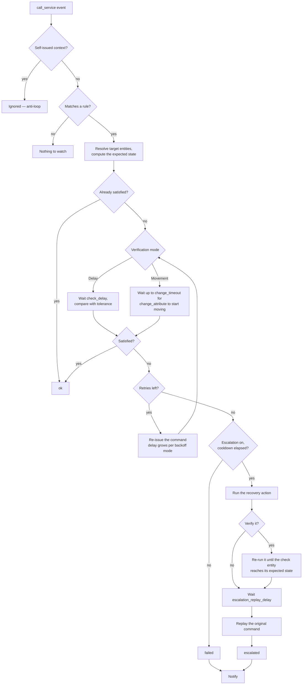
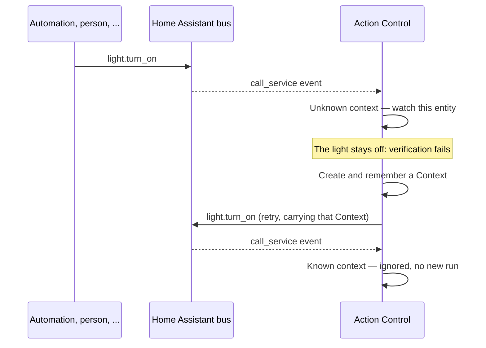
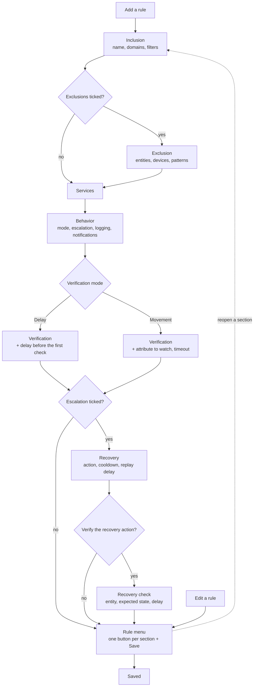

# Action Control — Documentation

*[English](documentation.md) | [Français](documentation.fr.md)*

## Table of contents

- [How it works](#how-it-works)
- [Configuring rules](#configuring-rules)
- [Rule reference](#rule-reference)
- [What gets compared](#what-gets-compared)
- [Status sensor](#status-sensor)
- [Recipes](#recipes)
- [Debug logging](#debug-logging)
- [Known limitations](#known-limitations)

## How it works

Action Control listens to Home Assistant's internal `call_service` event —
the event fired for *every* service call, regardless of what triggered it
(a person, an automation, a script, a voice assistant, another
integration). For each rule you have configured, on a matching call it:

1. **Resolves the target entities** — from `entity_id`, `device_id`,
   `area_id`, `label_id` and/or `floor_id` on the call, using the entity,
   device and area registries, then keeps only the entities that also pass
   the rule's own filters (domain, patterns, areas, labels, devices).
   Disabled entities, and entities with no state at all, are skipped: they
   could only ever fail the check.
2. **Computes what to expect** — the state the service implies, plus the
   attributes the call actually carried. This happens synchronously, in
   the event callback itself, so a `toggle` is judged against the state as
   it was the instant the command was issued. See [What gets
   compared](#what-gets-compared).
3. **Checks for an immediate match.** If the entity already reflects the
   requested state/attributes the instant the event fires (a no-op
   command, or one the target integration applied instantly), the rule
   resolves immediately — no delay, no notification.
4. Otherwise, depending on the mode:
   - **Delay mode** (the default): waits `check_delay` seconds, then
     compares the entity's state/attributes against what was requested,
     with tolerance. On a mismatch it re-issues the command and retries up
     to `retries` times, `retry_delay` seconds apart. Worst case:
     `check_delay + retries × retry_delay`.
   - **Movement mode** (`wait_for_change`, the default for covers):
     instead of comparing a snapshot after a fixed delay, waits up to
     `change_timeout` seconds for `change_attribute` to actually start
     changing. If it doesn't, that is the failure — the command is
     re-issued and the wait starts over, up to `retries` times.
     `retry_delay` is not used in this mode; worst case:
     `(retries + 1) × change_timeout`.
5. **On persistent failure**, if escalation is enabled and its cooldown
   has elapsed: runs the configured recovery action, arms the cooldown,
   waits `escalation_replay_delay` seconds, then replays the original
   command once more.
6. **Notifies** you (persistent notification and/or a `notify.*` service)
   with what was expected vs. what was actually observed.



Each retry re-issues the command for that one entity: the original target
keys (`entity_id`, `device_id`, `area_id`, `label_id`, `floor_id`) are
replaced by that entity's id, and the rest of the service data is kept
as-is.

Only one run at a time per (rule, entity) pair: if the same entity is
commanded again while a check is still in flight, the second run waits for
the first one to finish instead of racing it, and the older run is then
dropped rather than re-issuing a command that no longer reflects what was
asked. Several rules matching the same call each run independently.

### Anti-loop protection

Every command Action Control re-issues (a retry, the escalation action
itself, or the post-escalation replay) carries its own freshly created
Home Assistant `Context`, remembered internally for 120 seconds. The event
listener recognizes and ignores any `call_service` event carrying one of
these self-issued contexts *before* any processing — this is what prevents
a retry from re-triggering the same or another rule, with no guard entity
and no extra configuration.

That memory is intentionally in-process only (a Home Assistant restart
clears it). There is never anything meaningful to carry across a restart,
since a restart also stops any in-flight watchdog run.



## Configuring rules

Everything is configured from the integration's **Configure** button
(Settings → Devices & services → Action Control). The menu offers:

| Menu entry | What it does |
|---|---|
| Add a rule | Wizard: inclusion → services → behavior → the settings those choices need, ending on the rule menu. |
| Edit a rule | Straight to the rule menu, pre-filled with the selected rule. |
| Delete a rule | Asks for confirmation, then removes the rule and its sensor. |
| Global settings | Master switch and default values, see [Global settings](#global-settings). |

The wizard only asks for what a rule actually uses: you tick the
capabilities you want on the **Behavior** step, and the following
steps show the matching settings — nothing else. A rule that just retries
a command is four short steps; escalation and its verification only add
steps when you ask for them.

The last screen is the **rule menu**: one button per section, each with a
one-line summary of what it holds, plus *Save the rule*. Click a section,
correct it, and you are back on the menu — that is how you go back to
something. Nothing is written until you save, so closing the dialog
abandons the rule.

Editing an existing rule opens that menu directly, so changing one field no
longer means walking every form again.

Home Assistant's flow engine has no back navigation of its own, and an
integration cannot put a button on a form — a menu is the only thing the
interface renders as clickable buttons. Hence this shape.



Only one instance of the integration is needed — a second setup attempt is
aborted on purpose. Saving any change reloads the integration so the
sensors follow the rule list; that reload also cancels any check still in
flight and resets the status sensors to `idle`.

## Rule reference

### Inclusion

| Field | Description |
|---|---|
| Name | Label shown on the rule's status sensor and in notifications. |
| Rule enabled | Off pauses the rule without deleting it — its sensor stays, nothing is watched. Paused rules are prefixed with ⏸ in the rule pickers. |
| Domains | One or more domains this rule watches (e.g. `light`, `switch`, `cover`). Required. The picker lists the domains currently present in your instance, translated, and also accepts a domain typed by hand. |
| Services | Services within those domains to watch (e.g. `turn_on`). Suggestions cover every service of the chosen domains. Leave empty to watch every service in those domains. |
| Entity ID pattern | Optional glob pattern (e.g. `cover.volet_*`) the `entity_id` must match. Case-sensitive. |
| Friendly name pattern | Optional glob pattern matched against the entity's name, case-insensitively. |
| Areas / Labels / Devices | Optional filters — an entity matches if it (or its device) belongs to one of the selected areas/labels/devices. |
| Exclude some entities or devices | Off skips the **Exclusion** section entirely; unticking it on an existing rule also clears what that rule excluded. |

Filters are combined with AND: an entity must satisfy every filter that is
set. A rule with no pattern/area/label/device filter at all matches every
entity in scope for its domain(s)/service(s) — e.g. "watch every light".

### Exclusion

Shown only when *Exclude some entities or devices* is ticked on the
**Inclusion** step. Exclusions win over every filter above, which is what
lets a rule cover a whole domain minus a handful of entities.

| Field | Description |
|---|---|
| Entities to exclude | Pick them from a list, restricted to the rule's domains. This is the direct, readable way to drop a specific entity. |
| Devices to exclude | Drops **every** entity that device exposes. For "never watch anything on this device" — a gateway you know is unreliable, say. |
| Entity ID patterns to exclude | Glob patterns (e.g. `light.salon_multiprise_*`), for the wider cases. Add as many as you need — entities that duplicate one another rarely share a single prefix. |

The case this exists for is a switch also exposed as a light (Home
Assistant's *change device type*), watched and retried twice for a single
command. **Exclude the duplicate entity, not its device**: `switch_as_x`
attaches the derived `light.x` to the same device as `switch.x`, so a
device exclusion would drop both and leave the rule watching nothing.

### Behavior

The step that decides which of the other sections you'll be asked to fill in.

| Field | Description | Default |
|---|---|---|
| How to verify the command | **Delay** — wait, then compare state and attributes. **Movement** — wait for an attribute to actually start changing, for things that travel (covers). The choice decides which fields the verification step asks for. | Delay (Movement for `cover`) |
| Run a recovery action when it keeps failing | Off skips the recovery-action steps entirely. | off |
| Log a summary for this rule at info level | When on, every entity's final outcome (ok/escalated/failed) for this rule is also logged at `info` level — entity, outcome, response time, attempt count — visible without enabling debug logging. Off by default; the full step-by-step trace is still only in the debug log. | off |
| Notify via a persistent notification | Creates a `persistent_notification` titled `Action Control: <rule name>` on final failure. | on |
| Also notify via this notify service | Also calls this `notify.*` service on final failure, with the same title and message. | — |

### Verification

| Field | Description | Default (range) |
|---|---|---|
| Delay before the first check | Seconds to wait after the command before the first comparison. **Delay mode only.** | 2 (0–120) |
| Attributes to check | Attributes compared in addition to the state (e.g. `brightness`, `rgb_color`). Only those actually present in the service call are compared. | none |
| Tolerances | `attr:value, attr2:value2` — per-attribute numeric tolerance. List attributes (like `rgb_color`) apply the tolerance element by element. Entries that can't be parsed are ignored. | none (exact match) |
| Number of retries | How many times to re-issue the command if verification fails. | 2 (0–10) |
| Delay between retries | Seconds between each retry (delay mode only). | 2 (0–600) |
| Delay growth between retries | How the delay between retries grows: `constant` (same delay every time), `linear` (delay × attempt number), or `exponential` (delay doubles each time, capped at 3600 s). Only affects delay mode — movement mode has no delay between retries to begin with. | constant |
| Attribute to watch | The attribute movement mode watches (e.g. `current_position`). **Movement mode only**, and required — the step won't move on without it. | — |
| Timeout waiting for the change | Seconds to wait for that attribute to change before considering it a failure. **Movement mode only.** | 45 (1–600) |

When a rule targets exactly one of the `light`, `switch` or `cover`
domains, sensible defaults are pre-filled automatically:

| Domain | Pre-filled defaults |
|---|---|
| `light` | Attributes `brightness`, `rgb_color`, `color_temp_kelvin`, `xy_color`, with tolerances `5`, `5`, `100`, `0.01`. |
| `switch` | State only, no attribute. |
| `cover` | Movement mode on `current_position`, 45 s timeout. |

Any other domain — or a rule targeting several domains at once — starts
from a plain state-only check that you can refine with the fields above.

### Recovery

Only asked for when *Run a recovery action* is ticked.

| Field | Description | Default (range) |
|---|---|---|
| Escalation action | Any Home Assistant action sequence (service call, script, ...) — the same action editor as in automations. An action that fails is logged and does not break the run. | — |
| Minimum time between two escalations | Cooldown before the same rule may escalate again, in seconds. Counted from the moment the action has run, and shared by every entity of the rule. | 300 (0–86400) |
| Delay after escalation before replaying the command | Seconds to wait after the escalation action before replaying the original command. | 90 (0–3600) |
| Verify the recovery action worked | Adds one more step to check the recovery action actually took effect, instead of assuming it did. | off |

The cooldown is armed *before* the recovery action runs, and it survives a
restart, so entities failing at the same moment cannot fire the action
several times over. Escalation enabled without a configured action does
nothing and is logged as a warning.

### Recovery check

Only asked for when *Verify the recovery action worked* is ticked.

| Field | Description | Default (range) |
|---|---|---|
| Entity to verify after the recovery action | The entity whose state proves the recovery action worked. Required. | — |
| State it should reach | The state that entity must reach (e.g. `on`). Required. | — |
| Delay before checking it | Seconds to wait before the first check. | 5 (0–600) |

The recovery action is re-run (up to "Number of retries" times, with the
same delay-growth setting as the regular retries) until that entity reaches
the expected state, before the original command gets replayed. This is for
recovery actions that can fail too — a gateway restart switch that doesn't
always take on the first try, for instance. If it's still not confirmed
after all retries, the original command is replayed anyway (a warning is
logged), exactly as if no check had been configured.

The failure notification is sent right after the replay, without waiting
again: it describes the state observed at that moment, and mentions that a
recovery action was triggered. It carries a stable notification id per
(rule, entity), so a repeated failure replaces its notification instead of
stacking a new one. The replay itself is not re-verified — if it works, the
next status update comes from the next command on that entity.

### Global settings

| Field | Description | Default (range) |
|---|---|---|
| Action Control enabled | Master switch. When off, `call_service` events are ignored: no check, no retry, no notification. Rules keep their configuration. | on |
| Default number of retries for new rules | Pre-fills the retry field of a **new** rule. Existing rules keep their own value. | 2 (0–10) |
| Default delay between retries for new rules | Same, for the delay between retries. | 2 (0–600) |

## What gets compared

**Expected state.** It is derived from the service being called:

| Service | Expected state(s) |
|---|---|
| `turn_on` / `turn_off`, on/off domains only | `on` / `off` |
| `toggle`, on/off domains only | the opposite of the state at the moment of the call |
| `cover.open_cover`, `valve.open_valve` | `open` or `opening` |
| `cover.close_cover`, `valve.close_valve` | `closed` or `closing` |
| `cover.toggle`, `valve.toggle` | `closed`/`closing` if it was open, `open`/`opening` otherwise |
| `lock.lock` / `lock.unlock` / `lock.open` | `locked`/`locking`, `unlocked`/`unlocking`, `open`/`opening`/`unlocked` |
| any other service | none — only the attributes are compared |

The on/off domains are `light`, `switch`, `fan`, `siren`, `input_boolean`,
`humidifier`, `remote` and `automation`. Anything else — `climate`,
`media_player`, `water_heater`, ... — gets no expected state from
`turn_on`/`toggle`, because "on" is not what those entities report. States
that mean "on its way" (`opening`, `closing`, `locking`, ...) are accepted:
that is what movement mode is for.

**Expected attributes.** An attribute listed in *Attributes to check* is
only compared if the service call actually carried it: `light.turn_on`
without `brightness` does not check the brightness, even when `brightness`
is in the list. Two aliases handle service-data keys that differ from the
state attribute name:

- `cover.set_cover_position`, `valve.set_valve_position`: `position` →
  `current_position`
- `cover.set_cover_tilt_position`: `tilt_position` → `current_tilt_position`
- `light.turn_on`: `brightness_pct` → `brightness` (converted to 0–255) and
  `kelvin` → `color_temp_kelvin`; an explicit `brightness` in the call wins

**Comparison rules.**

- Numbers: match when `|expected − actual| ≤ tolerance` (tolerance `0`
  unless configured).
- Lists/tuples (`rgb_color`, `xy_color`, ...): compared element by element
  with the same tolerance; different lengths never match.
- Text, booleans, anything else: exact match.
- An attribute expected to be `None` always counts as satisfied; an entity
  with no state at all is always a mismatch.

**Domains with nothing meaningful to compare** (scenes, and any domain/
service combination not listed above with no attributes configured either)
get an expected state of `None` and no expected attributes. The early-exit
check on such a rule is then trivially satisfied — it resolves immediately,
with no delay and no retry, the first time it runs. This is intentional: a
scene's own state is a last-activated timestamp, not a target to reach, so
there is nothing to verify beyond the call having been accepted. A `scene`
preset (empty, like `switch`) exists mainly to make this explicit rather
than an implicit side effect.

## Status sensor

Each rule gets one diagnostic sensor named after the rule, grouped under a
single *Action Control* service device. Its state is the last known
outcome:

| State | Meaning |
|---|---|
| `idle` | No check has run yet (also the state right after a reload). |
| `ok` | Last check succeeded — immediately, or after a retry. |
| `retrying` | A check is in progress and the command is being re-issued. |
| `escalated` | Verification failed and the escalation action was run. |
| `failed` | Verification failed (no escalation, or still in cooldown). |

The state labels are translated (English/French), as are the notification
texts. Attributes: `entity_id`, `expected_state`, `expected_attributes`,
`actual_state`, `actual_attributes`, `attempt`, `mismatches`,
`last_checked` (UTC, ISO 8601), `response_duration` (seconds elapsed since
the command was issued, measured from the moment the `call_service` event
fired to the current status — keeps growing while `retrying`, settles once
the rule resolves).

The sensor reflects the rule's **latest** run. When one command targets
several entities, they are all watched, but the sensor keeps the last
update only — the debug log holds the full per-entity picture.

## Services

| Service | Purpose |
|---|---|
| `action_control.run_rule` | Test a rule on demand: re-issues a service call on a chosen entity and lets the rule verify it, exactly as if that call had happened normally. Fields: the rule (pick its status sensor), the entity to test, and optional service data — include a `service` key in it to use something other than the rule's first configured service. |
| `action_control.reset_escalation_cooldown` | Clears a rule's escalation cooldown so it can escalate again immediately, instead of waiting out the configured delay. |

Both take the rule's status sensor as the way to select it, so no rule id
needs to be typed in by hand.

## Diagnostics and repairs

The integration's entry supports Home Assistant's built-in diagnostics
download (rules, global settings, and current statuses, with anything that
looks like a token/password/API key/webhook id redacted) — useful when
filing a bug report.

If a rule targets an area, label, or device that has since been deleted, a
repair issue is raised on reload pointing at the rule by name; it clears
itself once the rule is fixed or the stale target is removed.

## Recipes

### Light watchdog

- Domains: `light`
- Services: `turn_on`, `turn_off`, `toggle` (or leave empty for all)
- Attributes to check: `brightness`, `rgb_color` (pre-filled by default)
- Retries: 2, delay 2 s

Verifies that the requested brightness/color were actually applied, with
tolerance, and retries on mismatch.

### Cover / gateway-restart watchdog

- Domains: `cover`
- Entity ID pattern: `cover.volet_*`
- How to verify the command: **Movement**, attribute `current_position`,
  timeout 45 s
- Run a recovery action: **on** — action = `switch.turn_on` on your
  gateway's restart switch, cooldown 300 s, replay delay 90 s
- Verify the recovery action worked: **on** — entity =
  `switch.gateway_restart`, state `on`, delay 5 s

Waits for a cover to actually start moving; if it doesn't after the
retries, turns on the gateway's restart switch, confirms the switch really
came back on (re-running the restart if it didn't), waits, then replays the
original command.

### Exact cover position

- Domains: `cover`
- Services: `set_cover_position`
- How to verify the command: **Delay**
- Attributes to check: `current_position`
- Tolerances: `current_position:2`
- Delay before the first check: 30 s (long enough for the cover to travel)

Verifies that a cover reached the position that was requested, ±2 %. The
`position` key of the service call is matched against the
`current_position` attribute automatically.

### Thermostat setpoint

- Domains: `climate`
- Services: `set_temperature`
- Attributes to check: `temperature`
- Tolerances: `temperature:0.2`
- Delay before the first check: 5 s

Catches setpoints silently dropped by a flaky radio link.

### Scene activation

- Domains: `scene`
- Services: `turn_on` (or leave empty)

There is nothing to verify (a scene's state is a timestamp, not a target),
so the rule resolves immediately with no delay and no retry. Configuring
it at all is mostly useful for the response-time metric it still records
(`response_duration` on the sensor, and the info-level log if enabled),
which doubles as confirmation that the `scene.turn_on` call itself went
through.

## Debug logging

Nothing needs a restart to try this: Developer tools → Actions → call
`logger.set_level` with:

```yaml
custom_components.action_control: debug
```

For a persistent setting, add this to `configuration.yaml` and fully
restart Home Assistant:

```yaml
logger:
  logs:
    custom_components.action_control: debug
```

At debug level you'll see which rules a service call matched, which
entities got watched and with what expected state/attributes, each
check/retry attempt with its mismatches, escalation and replay, ignored
self-issued calls, and outgoing notifications.

### What you get without enabling debug

These are always logged, no configuration needed:

| Level | When |
|---|---|
| `warning` | A rule's verification finally failed (with the mismatches). |
| `warning` | The escalation-check entity never reached its expected state. |
| `warning` | Escalation is enabled on a rule but no action is configured. |
| `error` | A command, escalation action or notification raised — logged with its traceback, without breaking the run. |

### The per-rule summary (`info`)

Ticking *Log a summary … at info level* on a rule's **Behavior**
step adds one `info` line per entity, each time that rule resolves:

```
Rule 'Lights watchdog': light.kitchen -> ok in 0.42s (0 attempt(s))
```

One line per entity and per outcome (`ok`, `escalated`, `failed`) — not one
per retry. It's the way to follow response times without turning on debug
for the whole component.

> **You will not see these lines in Settings → System → Logs.** That panel
> only shows `warning` and above. Click **Load full logs** there, or open
> `config/home-assistant.log` directly, and search for `Rule '`. This trips
> people up: the feature looks broken when it is only hidden.

If you'd rather not read logs at all, the same response time is available
as the `response_duration` attribute of the rule's status sensor.

Note that a run which gets **superseded** — a newer command for the same
entity arrives while a check is still in flight — stops without a final
line. The newer run logs its own outcome instead.

### When a rule never triggers

1. Check the master switch in *Global settings*.
2. Find the `call_service ...` debug line and compare the domain in it
   with your rule's domains: a rule only reacts to calls whose **domain**
   is in its list, and some helpers call services under their own domain
   (`homeassistant.turn_on` is a call in the `homeassistant` domain).
3. `... resolved to no entities` means the call carried no resolvable
   target; `has no state, nothing to watch` means the entity does not exist
   in Home Assistant (a disabled entity never gets watched either).
4. No `watching ...` line for your entity means one of the rule's filters
   (pattern, area, label, device) rejected it.
5. `Ignoring self-issued call_service event` means the call came from
   Action Control itself — that's the anti-loop protection doing its job.

### When a rule reports a failure that isn't one

If the mismatch shows the *opposite* of what was asked — expected `on`,
actual `off`, with the attributes at `None` — the entity was almost
certainly commanded again before the check finished, rather than failing to
apply the command.

A newer command normally cancels the check in flight, but only when it
reaches Action Control as a `call_service` event that the same rule
matches. It doesn't when:

- someone pressed a **physical switch**, or a remote is **bound directly**
  to the device (Zigbee groups/bindings never reach Home Assistant as a
  service call);
- the command went through **`homeassistant.turn_on`/`turn_off`**, or a
  scene or script that does — those are calls in the `homeassistant`
  domain, so a rule watching `light` or `switch` doesn't match them.

For the second case, add `homeassistant` to the rule's domains, or raise
`check_delay` so the dust settles before the comparison.

## Known limitations

- **Notification texts ship in English and French only**, picked from the
  Home Assistant language, English for anything else.
- **One status sensor per rule**, so a command targeting many entities at
  once only leaves the last outcome on the sensor.
- **Editing rules reloads the integration**, which cancels in-flight
  checks and resets the sensors to `idle`.
- **A check holds its (rule, entity) slot for the whole run**, sleeps
  included — so with escalation and a long replay delay, a new command on
  that same entity waits before being verified. Commands that are already
  obsolete by then are dropped rather than queued, and a run that starts
  late still resolves immediately if the entity is already in the
  requested state.
- **Only commands issued as service calls are seen.** A newer command
  cancels a check in flight, but only if it produced a `call_service`
  event a rule matches. A physical switch press, a remote bound straight to
  the bulb, or `homeassistant.turn_off` (which belongs to the
  `homeassistant` domain, not `light`/`switch`) are invisible — the entity
  moves, the check knows nothing about it, and reports the mismatch as a
  failure. See [When a rule reports a failure that isn't
  one](#when-a-rule-reports-a-failure-that-isnt-one).
- **The post-escalation replay is not verified**; it is the last action of
  the run.
